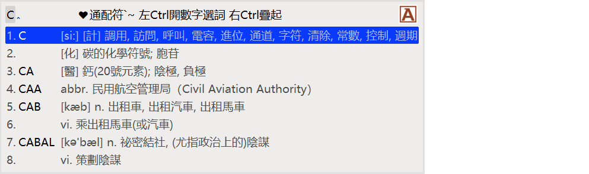

# Rime English輸入方案

本方案爲實現於Rime Weasel西文模式下輸入英文單詞而製作，所有功能均使用lua插件实现，請下載[Rime Weasel 0.14.3.148](https://bintray.com/rime/weasel/testing)。

## 功能說明：

- 西文模式下不論大寫狀態與否均可輸入英文單詞，獨立於中文模式
- 支持大小寫混合輸入，候選單詞自動匹配
- 在輸入過程中可使用通配符查詞
- 符號或空格直接連候選詞一齊上屏，數字則取決於數字選詞開關
- 可以將單詞註釋展開成多行或疊起爲一行
- 中文輸入法使用"朙月拼音"，請自行更改

## 詞典制作：
- 詞典來源於[skywind3000 ECDICT](https://github.com/skywind3000/ECDICT)
- 提供EXCEL文件<english.dict.xlsx>用於同步ECDICT及製作yaml詞典文件
